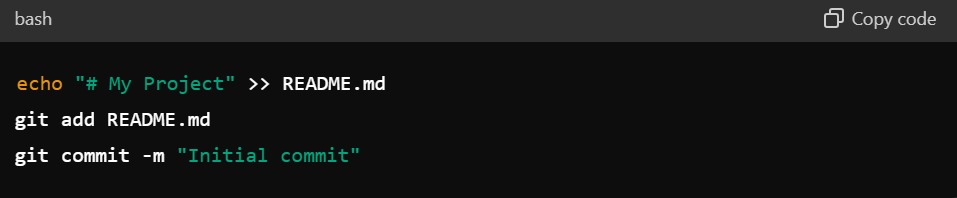

# Dev_Setup
Setup Development Environment

#Assignment: Setting Up Your Developer Environment

#Objective:
This assignment aims to familiarize you with the tools and configurations necessary to set up an efficient developer environment for software engineering projects. Completing this assignment will give you the skills required to set up a robust and productive workspace conducive to coding, debugging, version control, and collaboration.

#Tasks:

1. Select Your Operating System (OS):
   Choose an operating system that best suits your preferences and project requirements. Download and Install Windows 11. https://www.microsoft.com/software-download/windows11
Steps:
Download Windows 11:Go to the Windows 11 download page.
Click on "Download Now" and follow the instructions to create a bootable USB drive if needed.
Install Windows 11:Boot from the installation media you created.
Follow the on-screen instructions to install Windows 11.
Complete the setup by entering your Microsoft account details and configuring basic settings.

Challenges:
-Download Issues: Slow internet or issues with Microsoft's server hindered the download process.
-Compatibility Issues: Ensuring your hardware is compatible with Windows 11.

Strategies:
-Alternative Downloads: If the direct download fails, one can use the Media Creation Tool or an ISO file from the official site.
-Check Compatibility: One can use the PC Health Check app provided by Microsoft to ensure your system meets Windows 11 requirements.

2. Install a Text Editor or Integrated Development Environment (IDE):
   Select and install a text editor or IDE suitable for your programming languages and workflow. Download and Install Visual Studio Code. https://code.visualstudio.com/Download
Steps:
Download VS Code:Go to the Visual Studio Code download page.
Choose the Windows version and download the installer.
Install VS Code:Run the installer and follow the setup wizard.
Launch VS Code after installation

Challenges:
-Download Failures: Issues with the internet or the download site interrupted the process.
-Installation Errors: Conflicts with existing software or lack of administrative permissions.

Strategies:
-Reliable Internet: Ensure a stable internet connection or try downloading from an alternative network.
-Admin Permissions: Run the installer as an administrator to prevent permission issues.

3. Set Up Version Control System:
   Install Git and configure it on your local machine. Create a GitHub account for hosting your repositories. Initialize a Git repository for your project and make your first commit. https://github.com
Steps:
Install Git:Download Git from Git's official site (https://github.com)
Run the installer and follow the default settings.
Configure Git:Open a terminal or Git Bash and configure your Git username and email: 
Create a GitHub Account:Go to GitHub and sign up for an account.
Initialize a Git Repository:
-Create a new directory for your project:
-Initialize a Git repository: 
-Create a README file and make your first commit: 
Create a GitHub Repository:
-On GitHub, create a new repository.
-Follow the instructions to push your local repository to GitHub:

Challenges:
-Git Installation: Problems with the installer or conflicts with other software.
-GitHub Account Creation: Issues with email verification or account setup.
-Repository Initialization: Mistakes in command line instructions and network issues.

Strategies:
-Reinstall: If Git installation fails, try reinstalling or using an alternative installer.
-Account Verification: Check spam/junk folders for the verification email or use an alternative email address.
-Command Line Practice: Double-check command syntax and ensure a stable internet connection for pushing changes to GitHub.

4. Install Necessary Programming Languages and Runtimes:
  Instal Python from http://wwww.python.org programming language required for your project and install their respective compilers, interpreters, or runtimes. Ensure you have the necessary tools to build and execute your code.
Steps:
Download Python:
-Go to the Python download page (http://wwww.python.org)
-Download the latest version for Windows.
Install Python:
-Run the installer.
-Ensure you check "Add Python to PATH" during the installation process.
-Verify the installation by opening a terminal and running: 

Challenges:
-Download Errors: Issues with the Python download site.
-Installation Issues: Conflicts with previous versions or PATH configuration problems.

Strategies:
-Alternative Downloads: Use alternative mirrors or download sites.
-PATH Configuration: Manually add Python to your system's PATH if the installer fails to do so.

5. Install Package Managers:
   If applicable, install package managers like pip (Python).
To Install pip, the package manager for Python (it usually comes installed with Python).
Steps:
Verify pip Installation:
Run the following command in your terminal:

Challenges:
-pip Installation: Although pip comes with Python, there could be version mismatches or missing PATH entries.
-Network Issues: Problems connecting to package repositories.

Strategies:
-Verify Installation: Use python -m ensure pip to ensure pip is installed.
-Check PATH: Manually add pip to PATH if necessary.

6. Configure a Database (MySQL):
   Download and install MySQL database. https://dev.mysql.com/downloads/windows/installer/5.7.html
Steps:
Download MySQL Installer:
-Go to the MySQL download page (https://dev.mysql.com/downloads/windows/installer/5.7.html)
-Download the MySQL Installer.
Install MySQL:
-Run the installer and choose the "Developer Default" setup.
-Follow the setup wizard to complete the installation, configuring the root password and other settings as required.

Challenges:
-Download and Installation Errors: Issues with the MySQL installer and compatibility problems.
-Configuration Issues: Incorrect setup of the MySQL root password or network settings.

Strategies:
-Troubleshooting Installation: Refer to MySQL's official documentation for troubleshooting installation issues.
-Configuration Files: Edit MySQL configuration files manually if the wizard fails.

7. Set Up Development Environments and Virtualization (Optional):
   Consider using virtualization tools like Docker or virtual machines to isolate project dependencies and ensure consistent environments across different machines.
Steps:
Install Docker Desktop:
-Download Docker Desktop from Docker's website.
-Run the installer and follow the setup instructions.
Verify Docker Installation:
-Open a terminal and run: 

Challenges:
-Docker Installation: Issues with downloading or installing Docker.
-Running Containers: Problems with container configurations or network settings.

Strategies:
-Installation Guides: Follow official Docker installation guides closely.
-Community Support: Use Docker forums and Stack Overflow for troubleshooting container issues.

8. Explore Extensions and Plugins:
   Explore available extensions, plugins, and add-ons for your chosen text editor or IDE to enhance functionality, such as syntax highlighting, linting, code formatting, and version control integration.
Steps:
Open VS Code Extensions Marketplace:
-Click on the Extensions icon in the sidebar or press Ctrl+Shift+X.
Install Recommended Extensions:
-Python: Provides support for Python development.
-GitLens: Enhances Git capabilities.
-Prettier: Code formatter.
-ESLint: Linting for JavaScript.

Challenges:
-Extension Compatibility: Some extensions conflict with others or not work as expected.
-Overloading: Installing too many extensions slows down VS Code.

Strategies:
-Read Reviews: Check user reviews and ratings before installing extensions.
-Selective Installation: Install only necessary extensions to keep the IDE performant.

sample project GitHub repository link:https://github.com/RosemaryMAINA/A-sample-project.git
Screenshot: 

9. Document Your Setup:
    Create a comprehensive document outlining the steps you've taken to set up your developer environment. Include any configurations, customizations, or troubleshooting steps encountered during the process. 

#Deliverables:
- Document detailing the setup process with step-by-step instructions and screenshots where necessary.
- A GitHub repository containing a sample project initialized with Git and any necessary configuration files (e.g., .gitignore).
- A reflection on the challenges faced during setup and strategies employed to overcome them.

#Submission:
Submit your document and GitHub repository link through the designated platform or email to the instructor by the specified deadline.

#Evaluation Criteria:**
- Completeness and accuracy of setup documentation.
- Effectiveness of version control implementation.
- Appropriateness of tools selected for the project requirements.
- Clarity of reflection on challenges and solutions encountered.
- Adherence to submission guidelines and deadlines.

Note: Feel free to reach out for clarification or assistance with any aspect of the assignment.
